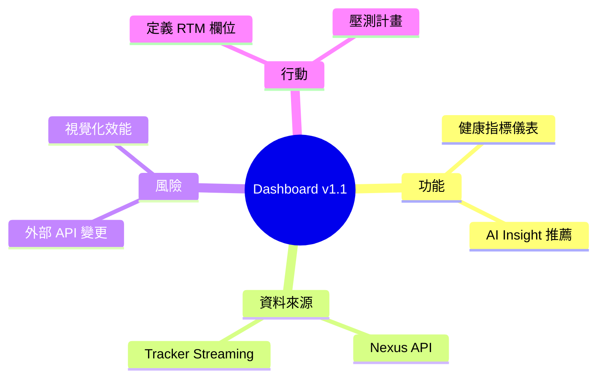

# 🧠 Mind Map Guide（思維導圖／探索工作坊範本）

此範本協助團隊在需求探索或工作坊階段快速建立思維導圖，以便後續轉換為 SRS/SDS 內容。

---

## 1. 會議資訊

| 項目       | 內容                                              |
| ---------- | ------------------------------------------------- |
| 工作坊名稱 | `<Session Title>`                                 |
| 日期       | `YYYY-MM-DD`                                      |
| 參與角色   | PO / SA / Dev / QA / GRC / Stakeholder            |
| 引導人     | `<Facilitator>`                                   |
| 輸出產物   | 思維導圖檔（Mermaid / XMind）、問題清單、決策紀錄 |

---

## 2. 建議流程

1. **Warm-up / Context**（5 min）  
   - 重申此次目標與限制。  
2. **核心主題拆解**（15 min）  
   - 以 `主題 → 子主題 → 想法` 層次收斂。  
3. **需求與風險標記**（15 min）  
   - 將各節點標記 FR/BR/NFR/Risk。  
4. **優先級與下一步**（10 min）  
   - 票選或加註 MOSCOW。  
5. **整理輸出**（5 min）  
   - 儲存檔案、將決策寫入 `.aiddm/session_context.md`。

---

## 3. Mermaid Mind Map 範例



可依需求增加 `((雙圈))` 表示核心、`[[]]` 表示決策等。

---

## 4. 標記建議

| 標記       | 說明                               |
| ---------- | ---------------------------------- |
| `FR`       | 功能需求（Functional Requirement） |
| `BR`       | 商務規則（Business Rule）          |
| `NFR`      | 非功能需求                         |
| `Risk`     | 風險或阻塞                         |
| `Idea`     | 待驗證想法                         |
| `Decision` | 已定結論，需寫入 session context   |

---

## 5. 匯出與追蹤

### 5.1 檔案儲存
會後將導圖檔存入專案對應位置：
```
Products/<ProductName>/i18n/zh-TW/Workshops/
  ├─ 2025-01-15_Dashboard_Requirements.md
  ├─ 2025-01-15_Dashboard_Requirements.png
  └─ session_notes.md
```

### 5.2 Session Context 紀錄範例
於 `.aiddm/session_context.md` 記錄：

```markdown
## 2025-01-15 Dashboard v1.1 需求工作坊

**參與者：** PM (Alice), SA (Bob), Dev (Carol), QA (David)  
**輸出：** [MindMap](../Products/Dashboard/i18n/zh-TW/Workshops/2025-01-15_Dashboard_Requirements.md)

### 決策事項
1. ✅ **採用 Recharts 作為圖表函式庫** - 決策者：Bob, Carol
   - 理由：輕量、TypeScript 支援完整
   - 風險：較少客製化彈性（可接受）

2. ⚠️ **外部 API 整合方式待確認** - 負責人：Bob, 截止：2025-01-20
   - 選項 A：Direct REST call
   - 選項 B：Message Queue (Kafka)
   - 需評估效能與可靠性

### 行動項
- [ ] Alice: 更新 VDP 里程碑（2025-01-16）
- [ ] Bob: 建立 SDS 初稿（2025-01-22）
- [ ] Carol: 設計 API 規格草稿（2025-01-20）

### 需轉為需求文件
- FR: 健康指標儀表、AI Insight 推薦 → SRS-FR-001~003
- NFR: API 回應時間 < 500ms → SRS-NFR-001
- Risk: 外部 API 變更風險 → VDP Risk R-01
```

### 5.3 AI 產出標記
若使用 AI 協助產出內容（如 GitHub Copilot、ChatGPT），請標記：
```markdown
> 🤖 **AI 產出提示：** 以下內容由 AI 協助產生，已由 [審閱者] 於 [日期] 審查確認。
```

---

## 6. 後續步驟建議

- 將 `FR/BR/NFR` 轉為 SRS 表格條目。  
- 將 `Risk` 對應至 VDP 的風險表。  
- 將 `Decision` 記錄於 Git Issue 或 session context，確保可追溯。

