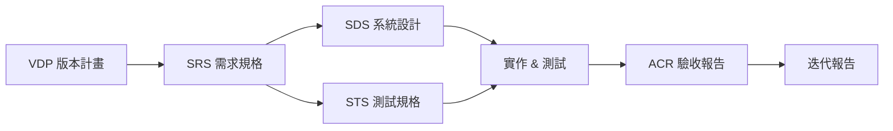

# AIDDM Templates（繁體中文版）

本資料夾提供 AIDDM 需求／設計／測試／報告等文件的繁體中文範本，支援文件驅動開發 (Documentation-Driven Development) 流程與需求追蹤。所有模板皆為 Markdown 格式，可直接複製至專案路徑後依指引填寫。

## 文件流程與關聯



## 可用範本

| 檔案                 | 用途                     |
| -------------------- | ------------------------ |
| `SRS_Template.md`    | 需求規格書 Template      |
| `SDS_Template.md`    | 系統設計規格書 Template  |
| `STS_Template.md`    | 測試規格書 Template      |
| `VDP_Template.md`    | 版本開發計畫 Template    |
| `ACR_Template.md`    | 驗收報告 Template        |
| `Report_Template.md` | 迭代／版本報告範本       |
| `MindMap_Guide.md`   | 探索工作坊／思維導圖指引 |

## 使用方式

1. 複製需要的檔案至專案目錄（例如 `Products/<Product>/i18n/zh-TW/`）。  
2. 依模板中的提示填寫欄位，並更新 Metadata（版本、日期、作者）。  
3. 若需英文版，複製同檔名至對應 `en/` 目錄，並翻譯內容。  
4. 完成後更新 `.aiddm/session_context.md`，紀錄本次文件變更與尚未決議的事項。  
5. 送出 PR 前請執行 `python tools/check_translation_parity.py`，確保多語文件齊備。

## ID 命名規範

為確保追蹤性，請遵循以下命名規則：

| 文件類型 | ID 前綴範例    | 說明                         |
| -------- | -------------- | ---------------------------- |
| SRS      | `SRS-FR-001`   | 功能需求（Functional）       |
| SRS      | `SRS-BR-001`   | 商務規則（Business Rule）    |
| SRS      | `SRS-NFR-001`  | 非功能需求（Non-Functional） |
| SDS      | `SDS-CMP-001`  | 元件設計（Component）        |
| SDS      | `SDS-API-001`  | API 設計                     |
| STS      | `STS-TC-001`   | 測試案例（Test Case）        |
| STS      | `STS-SUITE-UI` | 測試套件                     |
| VDP      | `M1`, `M2`     | 里程碑（Milestone）          |
| ACR      | `DEF-001`      | 缺陷編號（Defect）           |

### 追蹤關係範例

```
SRS-FR-001 (需求)
  ├─> SDS-CMP-001 (設計元件)
  ├─> SDS-API-002 (API 設計)
  └─> STS-TC-001, STS-TC-002 (測試案例)
```

## 延伸建議

- 針對不同產品可微調章節，但應保留 **Metadata**、**Change Log**、**Traceability** 等核心區塊。  
- 若有其他語系需求，請在對應 `i18n/<locale>/Templates/` 建立翻譯版本。  
- 任何改版請更新各模板的 **Change Log**，以便團隊得知最新格式。  
- 建議搭配 `tools/check_translation_parity.py` 確保多語版本同步。

## 常見問題

**Q: 需求 ID 可以重複使用嗎？**  
A: 不可以。每個 ID 在專案生命週期內應保持唯一，即使需求被刪除也不應重複使用舊 ID。

**Q: 如何處理跨文件的需求變更？**  
A: 使用 RTM（需求追蹤矩陣）追蹤所有關聯，變更時需同步更新 SRS、SDS、STS 及對應測試。

**Q: 模板可以刪減章節嗎？**  
A: 可以，但必須保留 Metadata、Change Log 與 Traceability 章節，以維持文件追蹤性。

