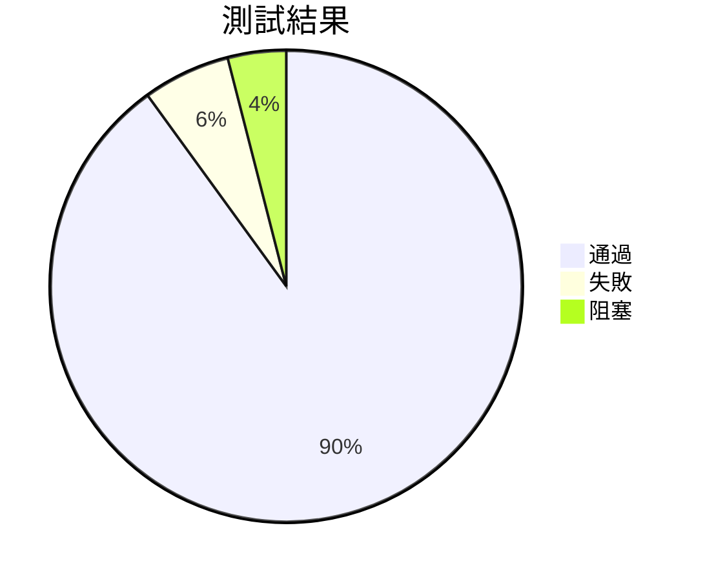

# 📊 Report Template（迭代／版本報告範本）

---
id: <DOC-ID>        # 必填，全專案唯一，如：REPORT-Sprint05-v1.0.0
type: REPORT        # 必填，如：SRS/SDS/SAS/STS/VDP/ACR/REPORT/NOTE
title: "<文件標題>"
version: "vX.Y.Z"
status: Draft        # Draft / In Review / Approved / In Development / Ready / Released / Archived
created: YYYY-MM-DD
updated: YYYY-MM-DD
owner: "<文件負責人>"
reviewer: "<審查人>"
approver: "<簽核人>"
related:
  - SRS-...
  - SDS-...
  - STS-...
---

---

## 1. 執行摘要

- 本期達成：`<亮點 / 功能>`  
- 主要指標：`RCR`、`TCR`、`RSR`、`測試通過率`  
- 風險／阻塞：`<簡述>`  
- 下一步決策：`<例：準備封版、進入 UAT>`  

---

## 2. 進度概況

| 里程碑          | 預計日期   | 實際日期   | 狀態 | 備註 |
| --------------- | ---------- | ---------- | ---- | ---- |
| 需求 / 設計評審 | YYYY-MM-DD | YYYY-MM-DD | ✅    |      |
| 開發完成        | YYYY-MM-DD | YYYY-MM-DD | ✅/⚠️  |      |
| 測試完成        | YYYY-MM-DD | YYYY-MM-DD |      |      |
| 驗收 / 發布     | YYYY-MM-DD | -          |      |      |

> 狀態：✅ 完成｜⚠️ 延遲｜❌ 阻塞

---

## 3. 交付內容

| 分類 | 項目             | 說明                 | 狀態 |
| ---- | ---------------- | -------------------- | ---- |
| 功能 | `<Feature Name>` | `<摘要>`             | ✅    |
| 文件 | `SRS v1.1.0`     | 已更新、審查完成     | ✅    |
| 測試 | `STS Suite`      | 自動化 95%           | ✅    |
| 報告 | `RTM Report`     | 產出於 `Reports/...` | ✅    |

---

## 4. 指標與品質

| 指標              | 目標 | 實際     | 備註     |
| ----------------- | ---- | -------- | -------- |
| 需求覆蓋率（RCR） | 95%  | `<XX%>`  |          |
| 追蹤覆蓋率（TCR） | 95%  | `<XX%>`  |          |
| 測試通過率        | 100% | `<XX%>`  |          |
| 缺陷數            | ≤ 5  | `<數量>` | 含嚴重度 |

可附圖（Mermaid 或截圖）：

---

## 5. 風險與問題

| 編號 | 類型 | 描述     | 影響   | 對策         | Owner    |
| ---- | ---- | -------- | ------ | ------------ | -------- |
| R-01 | 風險 | `<說明>` | High   | `<緩解措施>` | `<Name>` |
| I-02 | 問題 | `<說明>` | Medium | `<暫行方案>` | `<Name>` |

---

## 6. 決策與行動

1. `<決策項目>` – 負責人：`<Name>`，截止日：`YYYY-MM-DD`  
2. `<行動項目>` – 例：啟動 Hotfix、規劃下一版 VDP。  

---

## 7. 附錄

- 相關連結：`SRS/SDS/STS/ACR/RTM`、自動化測試報告、部署紀錄。  
- `.aiddm/session_context.md` 摘要：`<列出關鍵討論>`。
