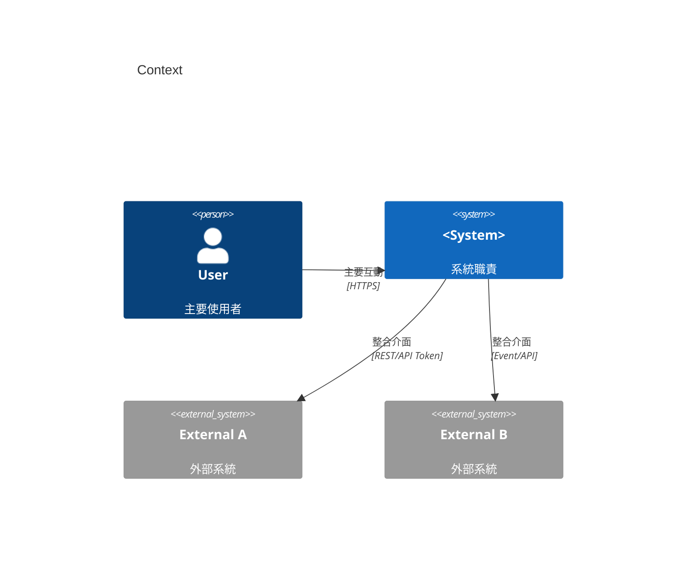
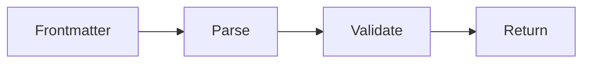

# <Project Name> 軟體設計規格書（SDS）

---
id: <DOC-ID>        # 必填，全專案唯一，如：SDS-Nexus-v1.0.0
type: SDS           # 必填，如：SRS/SDS/SAS/STS/VDP/ACR/REPORT/NOTE
title: "<文件標題>"
version: "vX.Y.Z"
status: Draft        # Draft / In Review / Approved / In Development / Ready / Released / Archived
created: YYYY-MM-DD
updated: YYYY-MM-DD
owner: "<文件負責人>"
reviewer: "<審查人>"
approver: "<簽核人>"
related:
  - SRS-...
  - SDS-...
  - STS-...
---

---

## 0. 變更紀錄
| 版本   | 日期       | 編輯     | 說明     |
| ------ | ---------- | -------- | -------- |
| v0.1.0 | YYYY-MM-DD | `<Name>` | 建立初稿 |

---

## 1. 系統總覽

### 1.1 系統背景
- 對應 SRS：列出涵蓋的 FR/BR/NFR/IR。
- 目標／場景：描述主要用例（例如 PR/Release 驗證）。
- 容量／效能假設：如 P95 延遲、並發等。

### 1.2 高階架構（C4 Context）

### 1.3 設計準則
- Security by Design／API First／Incremental／Traceability 等。
- 關鍵非功能：效能、可靠度、可觀測性等。

---

## 2. 系統視圖（Context & Integration）
| 外部系統      | 介面                  | 協定／安全    | 作用           |
| ------------- | --------------------- | ------------- | -------------- |
| `<System A>`  | REST `/...`           | OAuth/Token   | 讀取／寫入資料 |
| `<System B>`  | Event/Webhook         | Signed Secret | 接收事件       |
| `<Workspace>` | 檔案系統／Repo Access | 讀寫權限      | 讀取必要檔案   |

---

## 3. 組件設計
| 組件 ID         | 職責                 | 技術棧   | 輸入             | 輸出                | 追蹤（SRS）   |
| --------------- | -------------------- | -------- | ---------------- | ------------------- | ------------- |
| SDS-CMP-API     | 對外 API             | `<tech>` | HTTP 請求、Token | 任務狀態／資料      | SRS-IR-XXX    |
| SDS-CMP-CORE    | 核心邏輯／檢查／計算 | `<tech>` | 資料／檔案／設定 | 核心結果            | SRS-FR-XXX    |
| SDS-CMP-REPORT  | 報告／ACR 生成       | `<tech>` | 核心結果、證據   | 報告 JSON／Markdown | SRS-FR/BR-XXX |
| SDS-CMP-GATE    | 決策／Gate           | `<tech>` | 報告／政策       | pass/fail、原因     | SRS-FR-XXX    |
| SDS-CMP-STORAGE | 儲存／下載           | `<tech>` | 報告檔           | 路徑／URL           | SRS-BR-XXX    |

---

## 4. 資料設計

### 4.1 資料模型
| 資料物件 | 主鍵／標識 | 主要欄位   | 註記 |
| -------- | ---------- | ---------- | ---- |
| `<obj>`  | `<pk>`     | `<fields>` |      |

### 4.2 流程／產出
- 說明主要流程：擷取 → 檢查／計算 → 產出報告／ACR。

### 4.3 流程圖（範例：Frontmatter → Parse → Validate → Return）

### 4.4 I/O 規格
- 輸入：文件格式（Markdown/JSON/YAML）、報告格式（JUnit/Cobertura/LCOV）、變更範圍（diff/paths）、API 參數。
- 輸出：主要 JSON/Markdown 結構；必要欄位（id/version/timestamp/results/decision/sign_off 等）。

---

## 5. 安全考量
| 項目     | 設計作法                | 檢查對應    |
| -------- | ----------------------- | ----------- |
| 身份驗證 | OAuth/Token             | STS-SEC-XXX |
| 存取控制 | 權限檢查／下載授權      | STS-SEC-XXX |
| 日誌稽核 | JSON 日誌，遮蔽敏感資訊 | STS-SEC-XXX |

---

## 6. DevOps / 部署
| 項目       | 說明             |
| ---------- | ---------------- |
| 部署型態   | `<service/job>`  |
| CI/CD 流程 | `<steps>`        |
| 環境變數   | `<ENV_NAME>`     |
| 監控       | 指標、日誌、追蹤 |

---

## 7. 追蹤矩陣（Traceability）
| SRS ID  | 設計對應    | 測試對應（STS） |
| ------- | ----------- | --------------- |
| SRS-XXX | SDS-CMP-XXX | STS-XXX         |

---

## 8. 錯誤處理設計
| 類別         | 代碼              | 說明                 | API 回應（範例）                               | 行動／重試建議     |
| ------------ | ----------------- | -------------------- | ---------------------------------------------- | ------------------ |
| 驗證失敗     | `ERR-AUTH`        | Token/權限錯誤       | 401/403 + `{"code":"ERR-AUTH"}`                | 檢查 Token/權限    |
| 輸入格式錯誤 | `ERR-BAD-REQUEST` | 缺欄位/格式不符      | 400 + `{"code":"ERR-BAD-REQUEST","field":...}` | 修正後重試         |
| 來源不可讀   | `ERR-SOURCE`      | 無法讀取外部/檔案    | 502 + `{"code":"ERR-SOURCE"}`                  | 檢查路徑/服務      |
| 解析失敗     | `ERR-PARSE`       | 文件/報告解析錯誤    | 422 + `{"code":"ERR-PARSE"}`                   | 修正檔案後重跑     |
| 計算錯誤     | `ERR-CHECK`       | 檢查/計算失敗        | 500 + `{"code":"ERR-CHECK"}`                   | 重新執行/修復      |
| 持久化錯誤   | `ERR-STORAGE`     | 寫入儲存失敗         | 503 + `{"code":"ERR-STORAGE"}`                 | 檢查配額/重試      |
| 決策錯誤     | `ERR-GATE`        | Policy 缺失/計算錯誤 | 500 + `{"code":"ERR-GATE"}`                    | 修正 policy 後重試 |

- 日誌：輸出 `trace_id`, `code`, `message`, `resource`；遮蔽敏感資訊。
- 重試：來源／儲存可退避重試；其他需修正輸入或程式。

---

## 9. 未決議／風險
| 編號 | 說明     | 影響 | 行動       |
| ---- | -------- | ---- | ---------- |
| O-01 | `<TODO>` | High | `<Action>` |

---

## 10. 附錄
- 相關文件連結、API/報告範例等。
