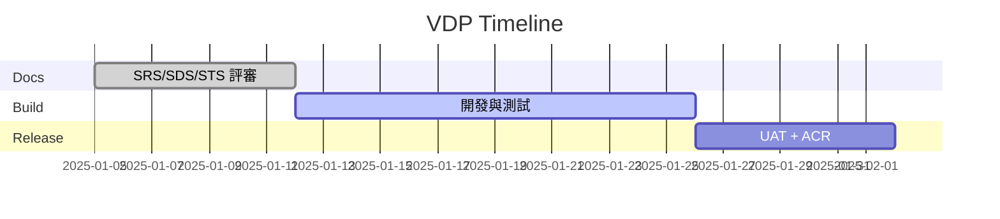
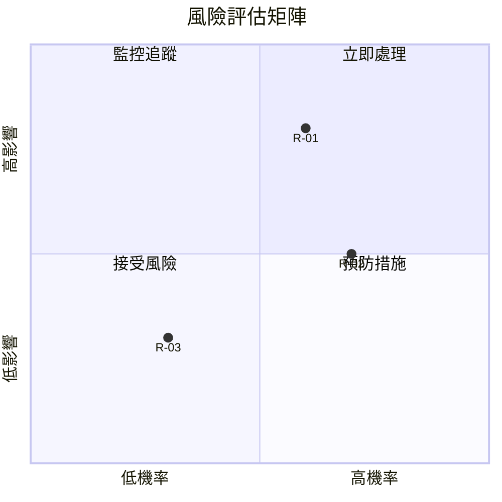

# 🗂️ VDP Template（版本開發計畫範本）

---
id: <DOC-ID>        # 必填，全專案唯一，如：VDP-v1.0.0
type: VDP           # 必填，如：SRS/SDS/SAS/STS/VDP/ACR/REPORT/NOTE
title: "<文件標題>"
version: "vX.Y.Z"
status: Draft        # Draft / In Review / Approved / In Development / Ready / Released / Archived
created: YYYY-MM-DD
updated: YYYY-MM-DD
owner: "<文件負責人>"
reviewer: "<審查人>"
approver: "<簽核人>"
related:
  - SRS-...
  - SDS-...
  - STS-...
---

---

## 0. 變更紀錄

| 版本   | 日期       | 編輯     | 摘要     |
| ------ | ---------- | -------- | -------- |
| v0.1.0 | YYYY-MM-DD | `<Name>` | 建立初稿 |

---

## 1. 版本目標

- **核心目標：** 例：完成 Dashboard RTM 視覺化、提升 RCR 至 95%。  
- **成功指標：**  
  - 功能完成率 ≥ 90%  
  - 報告產出時間縮短 30%  
- **不在範圍（Out of Scope）：** 例：後台權限重構、第三方計費模組。

---

## 2. 需求清單（摘要）

| 類型 | 需求 ID     | 敘述         | 優先級 | 責任人 |
| ---- | ----------- | ------------ | ------ | ------ |
| FR   | SRS-FR-001  | `<需求說明>` | Must   | Owner  |
| BR   | SRS-BR-002  |              | Should |        |
| NFR  | SRS-NFR-003 |              | Must   |        |

> 詳細請參考對應 SRS 章節與 RTM。

---

## 3. 里程碑與時程

| 里程碑 | 日期       | 內容                        | 檢查項目           |
| ------ | ---------- | --------------------------- | ------------------ |
| M1     | YYYY-MM-DD | 文件評審完成（SRS/SDS/STS） | PR / Meeting Notes |
| M2     | YYYY-MM-DD | 功能完成與單元測試通過      | Coverage ≥ 80%     |
| M3     | YYYY-MM-DD | UAT 驗收與 ACR 草稿         | TCR ≥ 95%          |

可附 Gantt/Timeline 圖：

---

## 4. 資源與分工

| 角色            | 人員     | 主要責任           |
| --------------- | -------- | ------------------ |
| Product / PM    | `<Name>` | 優先權、需求決策   |
| Engineering     | `<Name>` | 開發與程式整合     |
| QA / Validation | `<Name>` | STS、測試執行      |
| GRC             | `<Name>` | 合規稽核、ACR 簽核 |

---

## 5. 風險與應對

### 5.1 風險評估矩陣

### 5.2 風險清單

| 編號 | 風險描述                      | 影響   | 機率   | 風險等級 | 緩解措施                                | 應變計畫                     | 負責人 |
| ---- | ----------------------------- | ------ | ------ | -------- | --------------------------------------- | ---------------------------- | ------ |
| R-01 | 外部 Nexus API 突然變更或中斷 | High   | Medium | 🔴 高風險 | 1. 與供應商確認 ETA 2. 建立 Mock API | 切換至 fallback 資料源       | DevOps |
| R-02 | 文件審查會議延遲影響開發排程  | Medium | High   | 🟡 中風險 | 事先排定會議時段                        | 非同步審查 + 24hr 回應時間   | PM     |
| R-03 | 測試環境資源不足導致測試阻塞  | Medium | Low    | 🟢 低風險 | 預先申請額外 Azure 配額                 | 使用 local container testing | QA     |

**風險等級定義：**
- 🔴 **高風險**：影響 High + 機率 ≥ Medium → 需立即制定緩解計畫
- 🟡 **中風險**：影響或機率其中一項為 Medium/High → 持續監控
- 🟢 **低風險**：影響與機率皆為 Low → 接受並記錄

---

## 6. 驗收與封版條件

1. STS 測試案例 100% 執行，未通過項目有補救計畫。  
2. RTM 顯示 RCR ≥ 95%、RSR = 100%。  
3. ACR 完成並由 PM/QA/GRC 簽核。  
4. Git Tag `vX.Y.Z` 已建立，並更新 `CHANGELOG`。

---

## 7. 待決議題（Open Items）

| 編號 | 說明         | Owner    | 截止日     | 狀態 |
| ---- | ------------ | -------- | ---------- | ---- |
| O-01 | `<議題摘要>` | `<Name>` | YYYY-MM-DD | Open |

---

## 8. 版本結論（填寫於封版時）

- **實際完成日：**  
- **交付成果：**  
- **遺留事項：**  
- **下個版本建議：**

